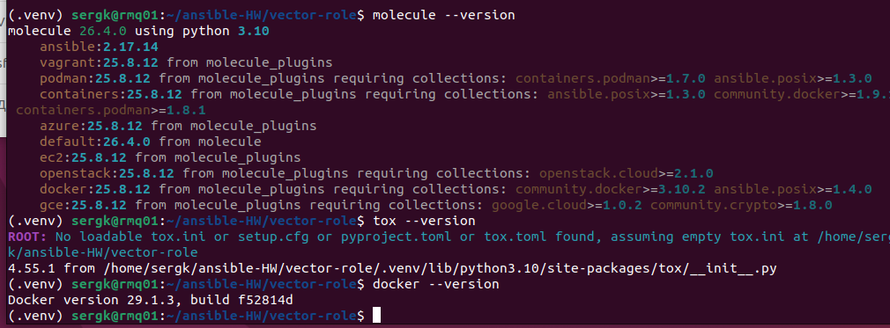
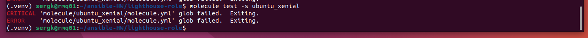
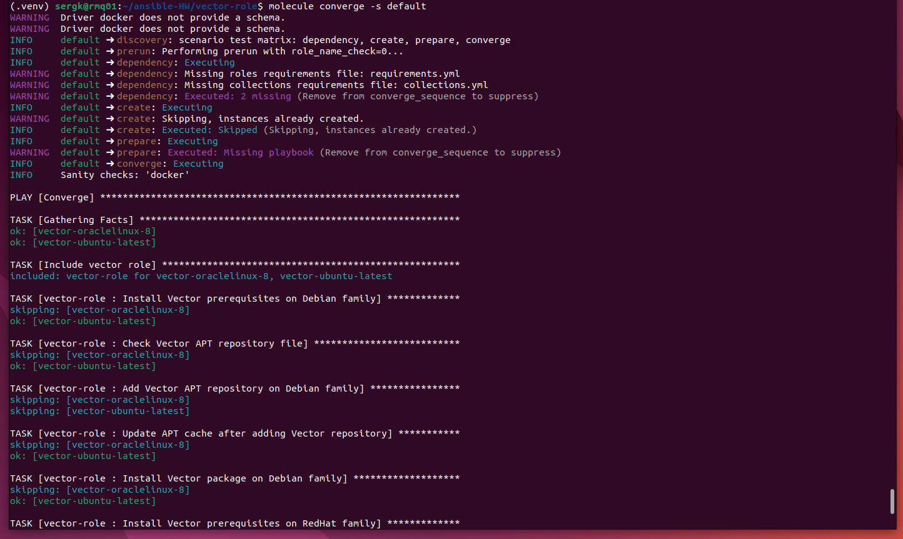
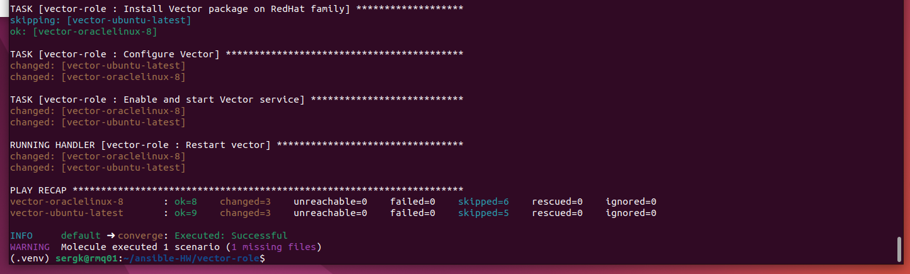
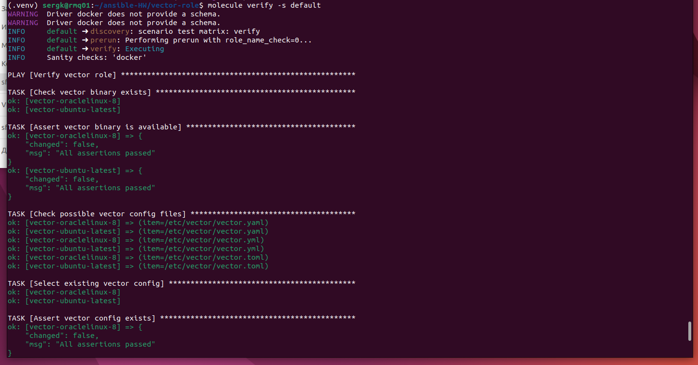
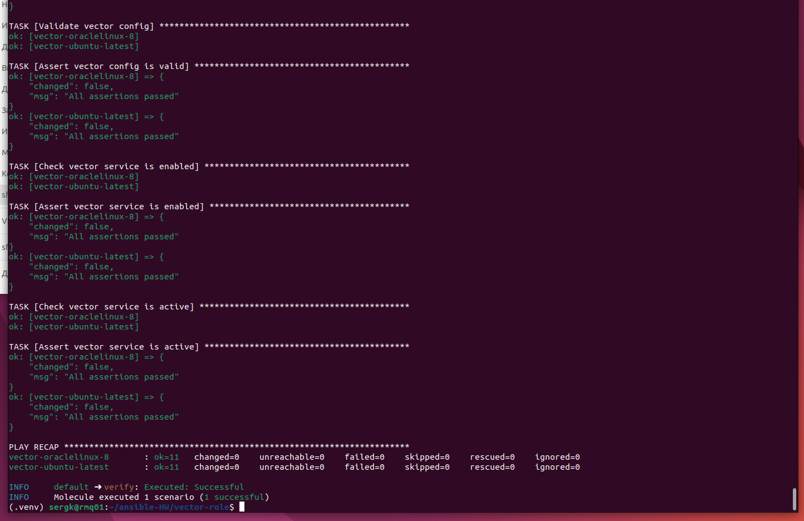
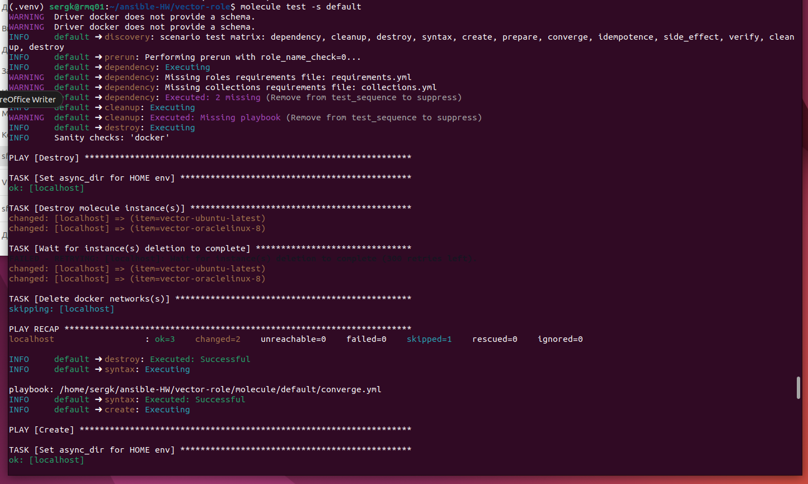
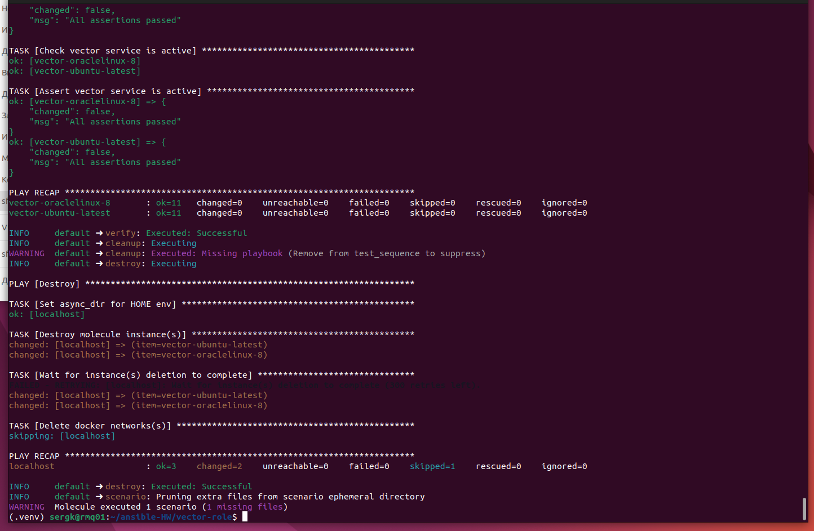

# Домашнее задание к занятию 5 «Тестирование roles»

## Подготовка к выполнению

1.Установите molecule и его драйвера: pip3 install "molecule molecule_docker molecule_podman.  
2.Выполните docker pull aragast/netology:latest — это образ с podman, tox и несколькими пайтонами (3.7 и 3.9) внутри.  

## Основная часть

Ваша цель — настроить тестирование ваших ролей.

Задача — сделать сценарии тестирования для vector.

Ожидаемый результат — все сценарии успешно проходят тестирование ролей.

## Molecule

1.Запустите molecule test -s ubuntu_xenial (или с любым другим сценарием, не имеет значения) внутри корневой директории clickhouse-role, посмотрите на вывод команды. Данная команда может отработать с ошибками или не отработать вовсе, это нормально. Наша цель - посмотреть как другие в реальном мире используют молекулу И из чего может состоять сценарий тестирования.
2.Перейдите в каталог с ролью vector-role и создайте сценарий тестирования по умолчанию при помощи molecule init scenario --driver-name docker.    
3.Добавьте несколько разных дистрибутивов (oraclelinux:8, ubuntu:latest) для инстансов и протестируйте роль, исправьте найденные ошибки, если они есть.  
4.Добавьте несколько assert в verify.yml-файл для проверки работоспособности vector-role (проверка, что конфиг валидный, проверка успешности запуска и др.).  
5.Запустите тестирование роли повторно и проверьте, что оно прошло успешно.  
6.Добавьте новый тег на коммит с рабочим сценарием в соответствии с семантическим версионированием.  

## Tox

1.Добавьте в директорию с vector-role файлы из директории.  
2.Запустите docker run --privileged=True -v <path_to_repo>:/opt/vector-role -w /opt/vector-role -it aragast/netology:latest /bin/bash, где path_to_repo — путь до корня репозитория с vector-role на вашей файловой системе.  
3.Внутри контейнера выполните команду tox, посмотрите на вывод.  
4.Создайте облегчённый сценарий для molecule с драйвером molecule_podman. Проверьте его на исполнимость.  
5.Пропишите правильную команду в tox.ini, чтобы запускался облегчённый сценарий.  
6.Запустите команду tox. Убедитесь, что всё отработало успешно.  
7.Добавьте новый тег на коммит с рабочим сценарием в соответствии с семантическим версионированием.  

После выполнения у вас должно получится два сценария molecule и один tox.ini файл в репозитории. Не забудьте указать в ответе теги решений Tox и Molecule заданий. В качестве решения пришлите ссылку на ваш репозиторий и скриншоты этапов выполнения задания.

## 1. Подготовка окружения

Работу выполнял из корня репозитория `vector-role`.

```bash
cd ~/vector-role
```


Установил Molecule, Docker/Podman-драйверы и Tox в виртуальное Python-окружение:

```bash
sudo apt update
sudo apt install -y python3 python3-pip python3-venv git

python3 -m venv .venv
source .venv/bin/activate

python3 -m pip install --upgrade pip setuptools wheel
python3 -m pip install ansible-core ansible-lint tox molecule "molecule-plugins[docker]" "molecule-plugins[podman]"
```

Проверка:

```bash
molecule --version
molecule drivers
ansible --version
tox --version
```

Дополнительно скачал учебный образ из задания:

```bash
docker pull aragast/netology:latest
```

## Molecule

В рамках задания был создан сценарий `molecule/default` с Docker-драйвером.

В качестве тестовых платформ добавлены:

- `ubuntu:latest`
- `oraclelinux:8`

При первом запуске Molecule были выявлены и исправлены ошибки:

1. В актуальной версии Molecule 26.4.0 параметр `--driver-name docker` отсутствует, поэтому сценарий был создан вручную, а Docker-драйвер указан в `molecule/default/molecule.yml`.
2. На `oraclelinux:8` Ansible падал из-за старого Python. В тестовый Dockerfile добавлен `python39`, а для хоста `vector-oraclelinux-8` указан `ansible_python_interpreter: /usr/bin/python3.9`.
3. На `ubuntu:latest` роль падала из-за использования `apt_key`. Подключение репозитория Vector было заменено на официальный установочный скрипт Vector.
4. Для RedHat/OracleLinux установка Vector была реализована через `dnf` command, чтобы избежать проблем с Python-зависимостями модуля `dnf`.
5. Vector не запускался в Molecule из-за ClickHouse healthcheck, так как ClickHouse внутри тестовых контейнеров не запущен. Для Molecule добавлен тестовый режим `vector_sink_type: console`.

В `verify.yml` добавлены assert-проверки:

- наличие бинарника `vector`;
- наличие конфигурационного файла Vector;
- валидность конфига через `vector validate`;
- включённый systemd-сервис `vector`;
- активный systemd-сервис `vector`.

Команды успешно выполнены:

```bash
molecule verify -s default
molecule test -s default
```

### Скриншоты:

Проверка версий: 

Ошибка при запуске molecule test: 

Проверка molecule coverage: 



molecule verify:



Успешный molecule test


